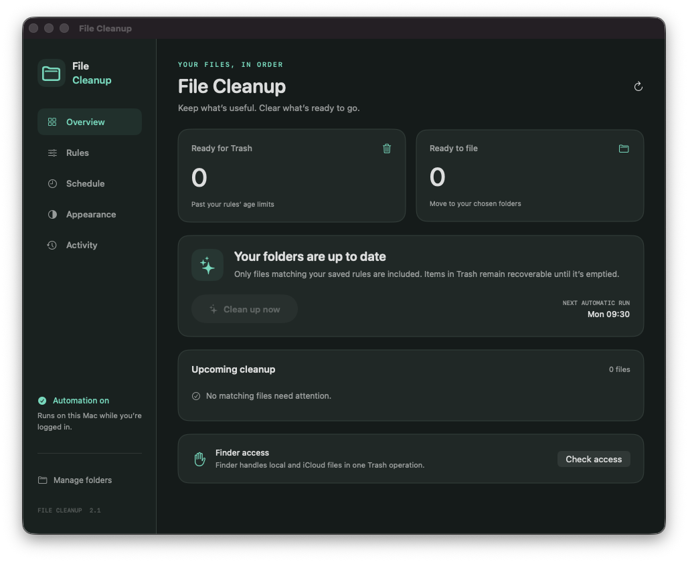
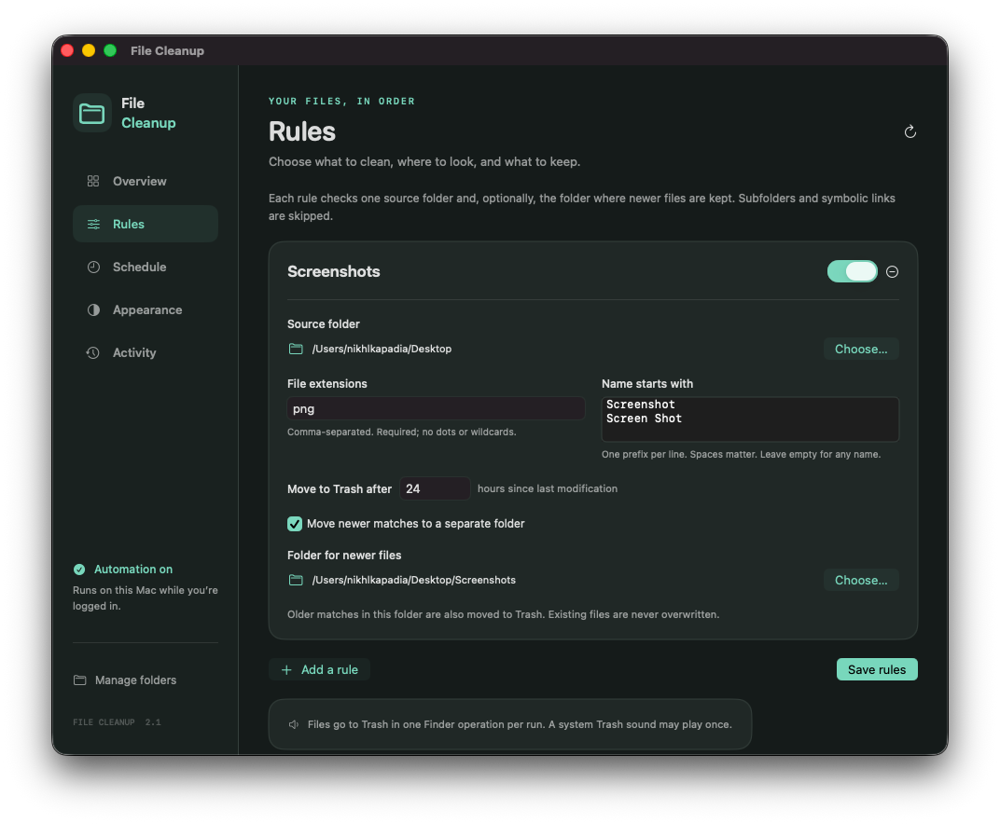
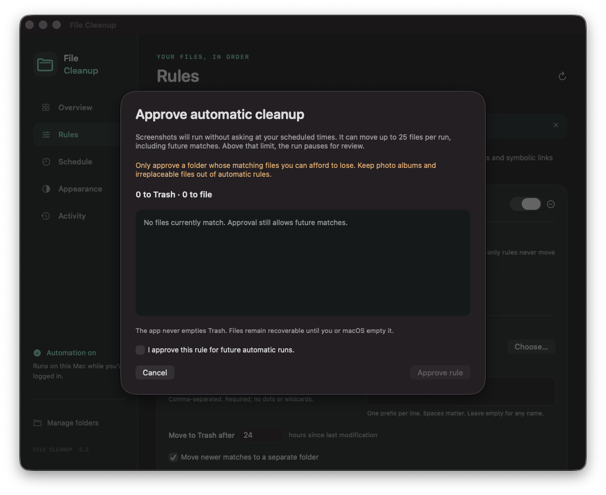

# File Cleanup

A native macOS app for organizing files with your own cleanup rules. Preview matching files, run cleanup now, edit daily times, and review recent results. Choose System, Light, or Dark appearance.



## Cleanup rules

Each rule controls:

- A source folder, selected with the macOS folder picker.
- File extensions, such as `png, jpg, pdf`. Extensions are case-insensitive.
- Optional filename prefixes, one per line. Prefixes are case-sensitive and preserve spaces. An empty list matches any name with the selected extensions.
- How many hours after its last modification a file becomes eligible for Trash.
- An optional destination for newer matches. Older matches in that destination are also eligible for Trash.

The initial rule matches `Screenshot *.png` and `Screen Shot *.png` in your own Desktop and Desktop/Screenshots folders, with a 24-hour threshold. Existing installations keep that exact rule automatic and retain their saved schedule. Other legacy rules start in review-only mode. You can change or replace this rule.

Rules inspect only the selected folders, not their subfolders. Symbolic links, hidden files, and directories are skipped. Enabled rules cannot share the same source or destination. Filing never overwrites an existing file.

Changes apply only after **Save rules**. Overview previews the saved rules. **Review cleanup** shows the full file list before a manual run. Manual and scheduled runs share the same rule engine.



## Safeguards

New rules, including the starter rule on a fresh installation, start in **Review only**. They can preview files but cannot move anything on a schedule. Use **Preview and approve** to inspect the current matches and approve future automatic runs, then save the rule. Changing its folders, filters, age, or file limit requires approval again.

Automatic cleanup pauses the entire run if any approved rule would move more than its limit. The default is 25 files per rule per run, counting both Trash and filing. The limit can be set from 1 to 1,000. Review-only rules are skipped. A scan error stops all file changes.

Manual cleanup lists every file and destination and requires confirmation. It rescans under the cleanup lock before moving anything. If saved rules or the matching file list changed, including file identity, modification times, and sizes, the run stops for another review.

The engine blocks system folders, your home folder itself, your Library, and folders inside packages such as Photos libraries. It skips subfolders and symbolic links. An ordinary photo folder can still match a rule, so leave irreplaceable files in review-only mode. Approval permits future matches and the limit applies per run, not across days. These guards reduce mistakes; they do not replace backups.



## Trash and sound

Matching old files are sent to Finder in one batch per run, including files managed by iCloud Drive. Inaccessible files are reported while accessible files are batched together. Finder may still play one system Trash sound; the app does not mute the Mac or change global sound preferences.

Files remain recoverable in Trash until it is emptied. A Finder batch error may mean some files already moved; Activity reports that uncertainty, and the next run rescans actual files without retrying each file separately.

## Build and install

Requires macOS 13 or later and Xcode command-line tools with Swift 5.9 or later. No third-party packages are required.

```sh
swift test
bash scripts/install.sh
open "$HOME/Applications/File Cleanup.app"
```

Quit the app before installing. The installer builds and signs a local app, backs up the previous app and schedule, and installs to `~/Applications/File Cleanup.app`. It migrates the old Screenshot Cleanup app and retains its bundle identity, settings, history, and LaunchAgent label.

Click **Check access** and allow File Cleanup to control Finder. macOS may also request access to protected folders used by your rules. If access was denied, use System Settings → Privacy & Security → Automation for Finder, or Files and Folders for protected folder access. An existing permission entry may retain the previous app name. Full Disk Access is not an app requirement.

## Schedule and appearance

In **Schedule**, choose one to eight distinct daily times and save. The initial times are 9:30 and 10:00 in the Mac’s local time zone. Turn off Daily cleanup and save to pause. The window can be closed; scheduled runs need a logged-in user session. macOS may catch up after waking from sleep.

In **Appearance**, choose System, Light, or Dark. The window previews the change immediately. Save to keep the choice across launches. Each settings page saves its own changes, so saving an appearance does not activate unsaved cleanup rules.

## Local files

| Purpose | Location |
| --- | --- |
| Installed app | `~/Applications/File Cleanup.app` |
| Settings and history | `~/Library/Application Support/Screenshot Cleanup/` |
| Installation backups | `~/Library/Application Support/Screenshot Cleanup/Backups/` |
| LaunchAgent | `~/Library/LaunchAgents/com.nikhlkapadia.cleanup-desktop-screenshots.plist` |
| Scheduled log | `~/.local/var/log/cleanup-desktop-screenshots.log` |

The older internal names are retained for upgrade compatibility. Paths derive from the current user’s home directory. The app makes no network requests; Finder handles normal synchronization for cloud-managed files.

## Development

```sh
swift build
swift test
bash scripts/build.sh
```

Build output is `.build/File Cleanup.app`. The executable retains its internal name, `ScreenshotCleanup`. It accepts `--dry-run` for a read-only preview, `--scheduled` for background cleanup, and `--install-schedule` to apply saved settings. Local builds are ad hoc signed; rebuilding may cause macOS to request permissions again.

The original implementation lived in Argus under `cron/`. This repository owns File Cleanup now. The Argus build script is legacy and should not be used to update the app.

See [the cleanup workflow](docs/flows/cleanup.md) for behavior, failure handling, and verification.
