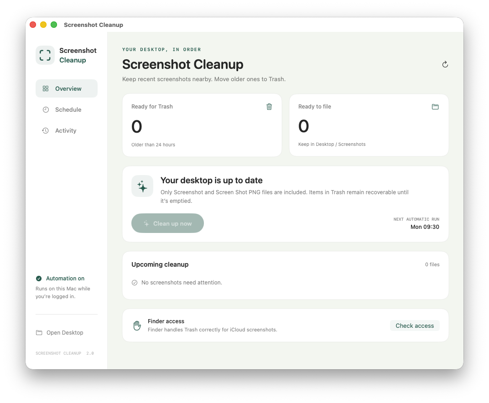
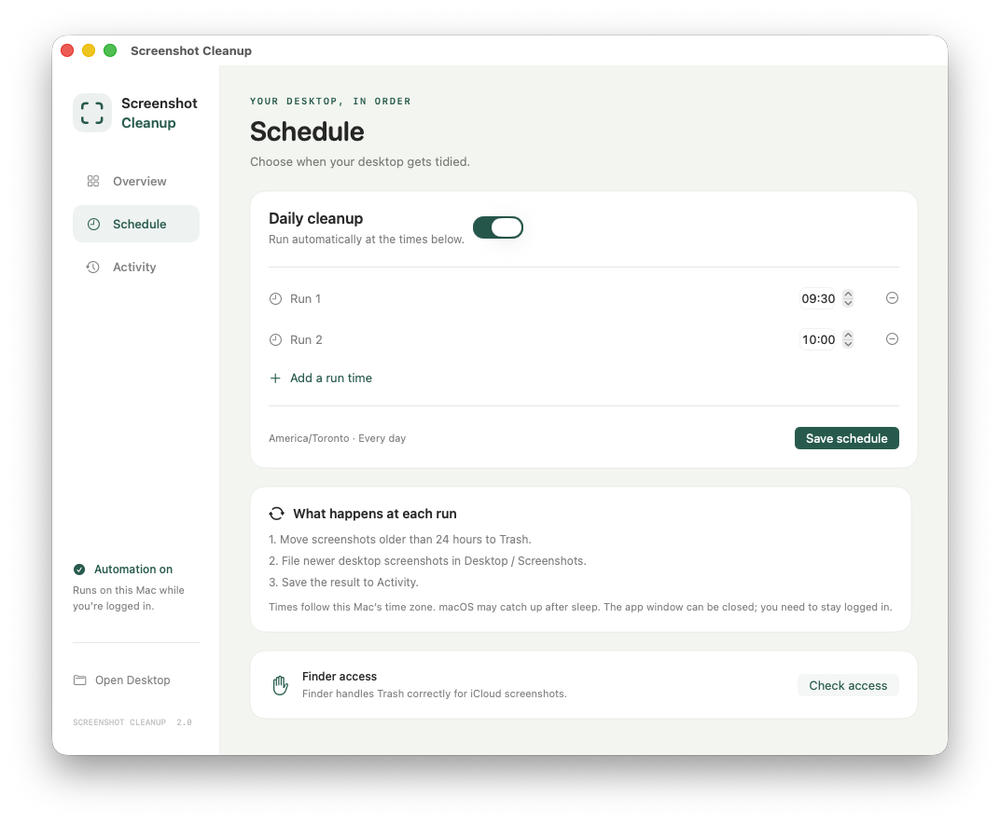

# Screenshot Cleanup

A native macOS app for keeping Desktop screenshots organized. Open the app to preview cleanup, run it now, edit daily run times, or inspect recent results.



## What it does

- Moves matching screenshots older than 24 hours to Trash through Finder, including iCloud Drive files.
- Files newer screenshots in `~/Desktop/Screenshots` without overwriting existing files.
- Recognizes `Screenshot *.png` and `Screen Shot *.png`, including uppercase PNG extensions. Searches only Desktop and its Screenshots folder. Skips symlinks, folders, and other files.
- Runs daily at configurable times. The initial times are 9:30 and 10:00 in the Mac’s local time zone.
- Keeps the last 30 run results and continues after individual file errors.

Opening the app displays its window. Only the **Clean up now** button or a scheduled invocation starts cleanup. Items remain in Trash until you empty it.

## Build and install

Requires macOS 13 or later and Xcode command-line tools with Swift 5.9 or later. No third-party packages are required.

```sh
swift test
bash scripts/install.sh
open "$HOME/Applications/Screenshot Cleanup.app"
```

The installer builds and signs a local app, backs up the installed version and existing schedule, installs to `~/Applications`, and migrates the existing `com.nikhlkapadia.cleanup-desktop-screenshots` LaunchAgent. It preserves saved settings. Close the app before reinstalling.

In the app, click **Check access** and allow it to control Finder. Desktop permission may also be requested. If access was denied, open System Settings → Privacy & Security → Automation and enable Finder under Screenshot Cleanup. Desktop access is under Files and Folders. Full Disk Access is not an app requirement.

## Schedule

Open **Schedule**, choose one to eight distinct times, and click **Save schedule**. Turn off Daily cleanup and save to pause automation. Closing the window does not stop the schedule. Scheduled runs need a logged-in user session; macOS may run a missed job after waking from sleep.

The scheduler uses the same cleanup engine and a shared lock as manual runs. Schedule changes replace the LaunchAgent and roll back if installation fails. Quitting during a cleanup or schedule save is blocked until the operation finishes.



## Local files

| Purpose | Location |
| --- | --- |
| Installed app | `~/Applications/Screenshot Cleanup.app` |
| Settings and history | `~/Library/Application Support/Screenshot Cleanup/` |
| Installation backups | `~/Library/Application Support/Screenshot Cleanup/Backups/` |
| LaunchAgent | `~/Library/LaunchAgents/com.nikhlkapadia.cleanup-desktop-screenshots.plist` |
| Scheduled log | `~/.local/var/log/cleanup-desktop-screenshots.log` |

These files stay on the Mac. The app makes no network requests. Finder performs normal iCloud synchronization for files managed by iCloud Drive.

## Development

```sh
swift build
swift test
bash scripts/build.sh
```

Build output is `.build/Screenshot Cleanup.app`. The local build is ad hoc signed with the existing bundle identifier. Rebuilding can cause macOS to ask for permissions again.

The executable accepts `--dry-run` for a read-only file preview, `--scheduled` for a background cleanup, and `--install-schedule` to apply saved scheduling settings. Run tests against temporary files; never use real Desktop files as test fixtures.

The original implementation lived in Argus under `cron/`. This repository owns the app now. The Argus build script is legacy and would replace this UI with the old background-only app.

See [the cleanup workflow](docs/flows/cleanup.md) for behavior, failure handling, and verification evidence.
